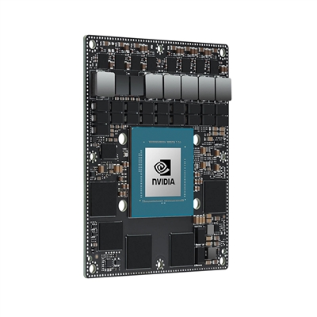

# Arches-Hardware

## 🌟 Welcome to Arches-Hardware - Open Source AI Platform

**Accelerating Edge AI Through Open Collaboration**

This repository houses the complete design schematics, Bill of Materials (BOM), and comprehensive documentation for our Arches-Hardware platform - a powerful NVIDIA Jetson Orin NX and Nano based solution optimized for AI at the edge. By open-sourcing these designs, we're breaking down barriers to AI hardware development and enabling a global community to innovate faster and more efficiently.

### 🎯 Our Mission
At Soccentric, we believe AI should be accessible to everyone. Our open source initiative aims to:
- **Democratize AI Hardware**: Provide proven, high-performance AI platform designs
- **Foster Innovation**: Create a foundation for the next generation of intelligent devices
- **Build Community**: Unite developers, researchers, and businesses in collaborative advancement
- **Accelerate Time-to-Market**: Offer ready-to-use templates for rapid product development

### 📋 What's Included
- **Complete Hardware Designs**: Full schematics and PCB layouts for Jetson-based platforms
- **Detailed BOM**: Curated component lists with multiple sourcing options
- **Manufacturing Files**: Gerber files, drill files, and assembly drawings
- **Design Validation**: Test procedures, performance benchmarks, and validation reports
- **Software Integration**: Sample applications and integration guides
- **Thermal Management**: Heat sink designs and thermal analysis data

**Author:** Sandesh Ghimire  
**©** Sandesh@soccentric.com

## Overview
NVIDIA Jetson Orin NX and Nano based hardware platform providing high-performance AI computing at the edge. These System-on-Modules deliver exceptional AI inference capabilities with power-efficient processing, making them perfect for autonomous machines, robotics, and intelligent video analytics.

## Key Specifications
- **AI Performance**: Up to 275 TOPS (AGX Orin), 157 TOPS (Orin NX), 67 TOPS (Orin Nano)
- **GPU**: Up to 2048-core NVIDIA Ampere architecture GPU with 64 Tensor Cores
- **CPU**: Up to 12-core Arm Cortex-A78AE @ up to 2.2GHz
- **Memory**: Up to 64GB LPDDR5 with ECC
- **Storage**: Support for NVMe SSDs via PCIe
- **Power Consumption**: Configurable between 7W-25W (Nano), 10W-40W (NX), 15W-60W (AGX)
- **Video**: Hardware-accelerated video codec supporting multiple streams

## Interfaces and Connectivity
All platforms have:
1. **Camera Interface**: Multiple MIPI CSI-2 lanes supporting high-resolution cameras
2. **Display Interface**: MIPI DSI for direct display connection
3. **USB**: Multiple USB 3.2 Gen 2 ports for high-speed peripherals
4. **UART**: Serial communication interfaces for debugging and control
5. **I2C/SPI**: Standard serial interfaces for sensor and device connectivity
6. **PCIe**: Gen 4 PCIe for high-speed SSD storage and expansion cards
7. **Ethernet**: Gigabit Ethernet with support for Time-Sensitive Networking (TSN)
8. **Wi-Fi/Bluetooth**: Integrated wireless connectivity options
9. **CAN**: Controller Area Network for automotive and industrial applications
10. **GPIO**: General-purpose I/O pins for custom interfaces

## Capabilities
- **AI/ML Inference**: High-performance deep learning inference with TensorRT optimization
- **Computer Vision**: Real-time image processing, object detection, and tracking
- **Generative AI**: Support for transformer-based models and generative tasks
- **Robotics**: Advanced motion planning and control algorithms
- **Video Analytics**: Multi-stream video processing with AI-enhanced analytics
- **Edge Computing**: Distributed intelligence with cloud-native workflows
- **Real-time Processing**: Deterministic latency for critical applications
- **Multi-modal AI**: Combined vision, speech, and sensor data processing

## Software Ecosystem
- **JetPack SDK**: Complete development environment with Jetson software stack
- **Isaac Platform**: Robotics development framework with simulation tools
- **DeepStream**: Video analytics SDK for intelligent video applications
- **TAO Toolkit**: AI model training and optimization tools
- **NGC Catalog**: Pre-trained models and containers for rapid deployment

## Supported Operating Systems
- NVIDIA Jetson Linux (Ubuntu-based)
- Real-time variants for deterministic applications

## Applications
- Autonomous vehicles and ADAS systems
- Industrial robotics and automation
- Intelligent video surveillance and analytics
- Medical imaging and diagnostics
- Smart cities and infrastructure monitoring
- Retail analytics and customer insights
- Agricultural automation and precision farming
- Drones and unmanned aerial systems

## Additional Features
- **Power Management**: Dynamic voltage and frequency scaling for optimal efficiency
- **Security**: Hardware-based security with secure boot and encryption
- **Developer Tools**: Comprehensive SDK, debuggers, and profiling tools
- **Cloud Integration**: Seamless connection to cloud AI services
- **Partner Ecosystem**: Extensive hardware and software partner support
- **Long-term Support**: Extended software maintenance and updates

## 🚀 Getting Started

### Prerequisites
- NVIDIA Jetson Orin NX/Nano module
- PCB manufacturing capabilities
- Thermal management components
- AI development environment (JetPack SDK)

### Quick Start
1. **Explore the Designs**: Review schematics in `hardware/schematics/`
2. **Review BOM**: Check component availability in `bom/`
3. **Manufacture PCB**: Use files in `pcb/` for fabrication
4. **Assemble & Test**: Follow guides in `docs/`
5. **Deploy AI Models**: Use provided examples to get started

### Development Environment
- **JetPack SDK**: NVIDIA's complete development platform
- **Isaac Platform**: Robotics and AI development framework
- **DeepStream**: Video analytics SDK
- **TensorRT**: High-performance deep learning inference

## 🤝 Contributing

Join our community of AI hardware innovators!

### Ways to Contribute
- **AI Model Optimization**: Share optimized models for the platform
- **Performance Benchmarks**: Contribute benchmark results and comparisons
- **Hardware Improvements**: Submit design enhancements and optimizations
- **Documentation**: Help expand guides and tutorials
- **Bug Fixes**: Report and fix issues in designs or documentation

### Development Workflow
1. Fork this repository
2. Create your feature branch (`git checkout -b feature/ai-enhancement`)
3. Make your changes and test thoroughly
4. Commit with clear messages (`git commit -m 'Optimize thermal design'`)
5. Push and create a Pull Request

### Guidelines
- Test all hardware changes on actual boards
- Include performance metrics for AI-related changes
- Document thermal and power considerations
- Follow NVIDIA's Jetson design guidelines

## 📄 License

Licensed under CERN Open Hardware Licence Version 2 - Permissive. See [LICENSE](LICENSE) for full terms.

This license enables commercial use, modification, and distribution of derivative works while requiring attribution.

## 📞 Support & Community

- **Issues**: [GitHub Issues](https://github.com/soccentric/Arches-Hardware/issues)
- **Discussions**: [GitHub Discussions](https://github.com/soccentric/Arches-Hardware/discussions)
- **NVIDIA Forums**: Connect with the broader Jetson community
- **Email**: hardware@soccentric.com for business inquiries

## 🙏 Acknowledgments

- NVIDIA for the revolutionary Jetson platform
- Our contributors and early adopters
- The AI and robotics communities driving innovation

---

**Powered by AI, Fueled by Community - Soccentric**